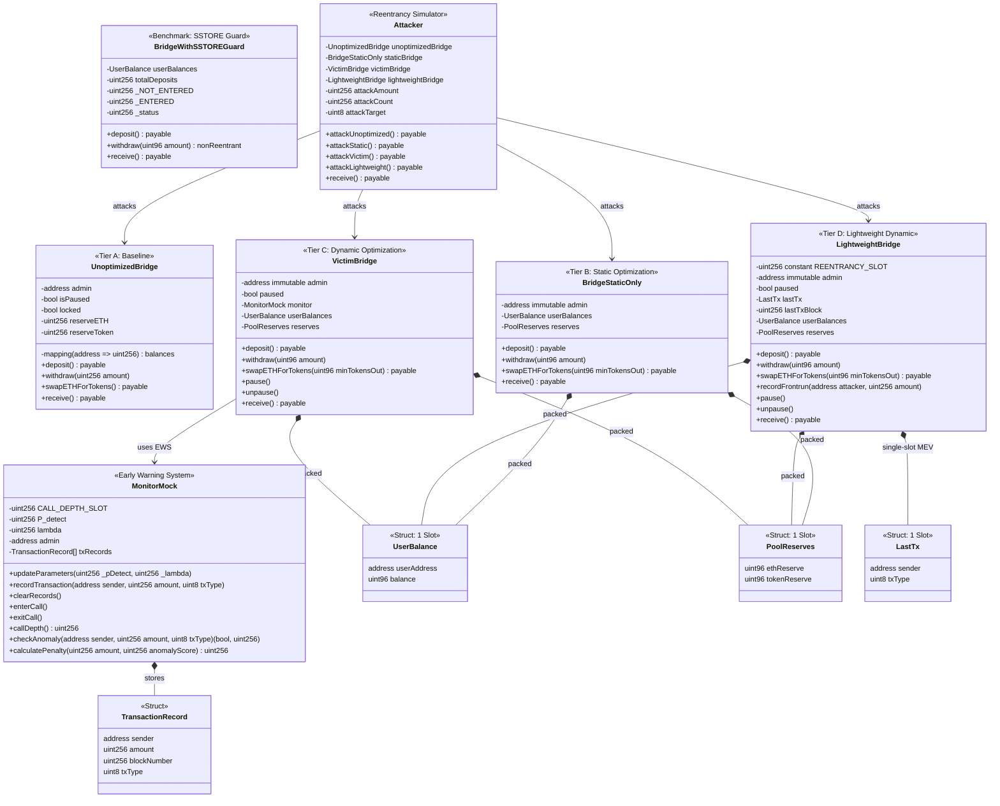
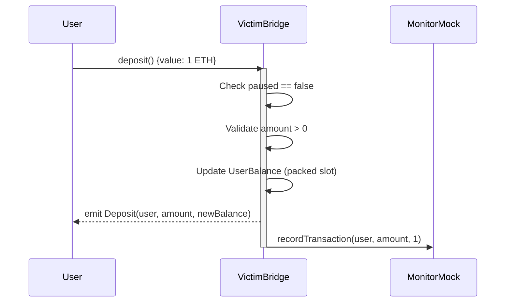
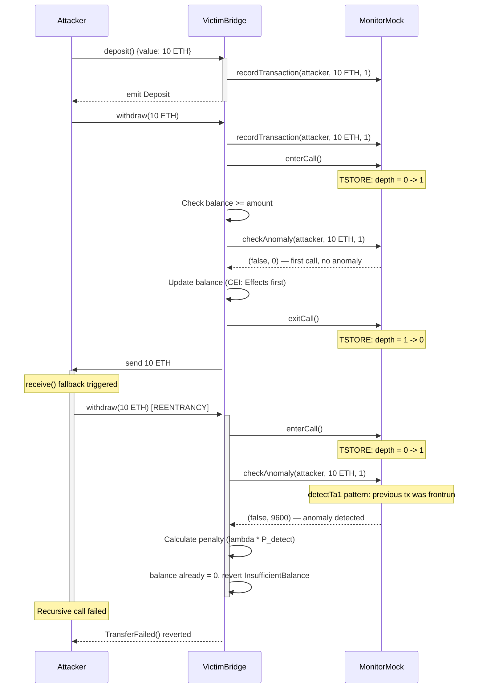
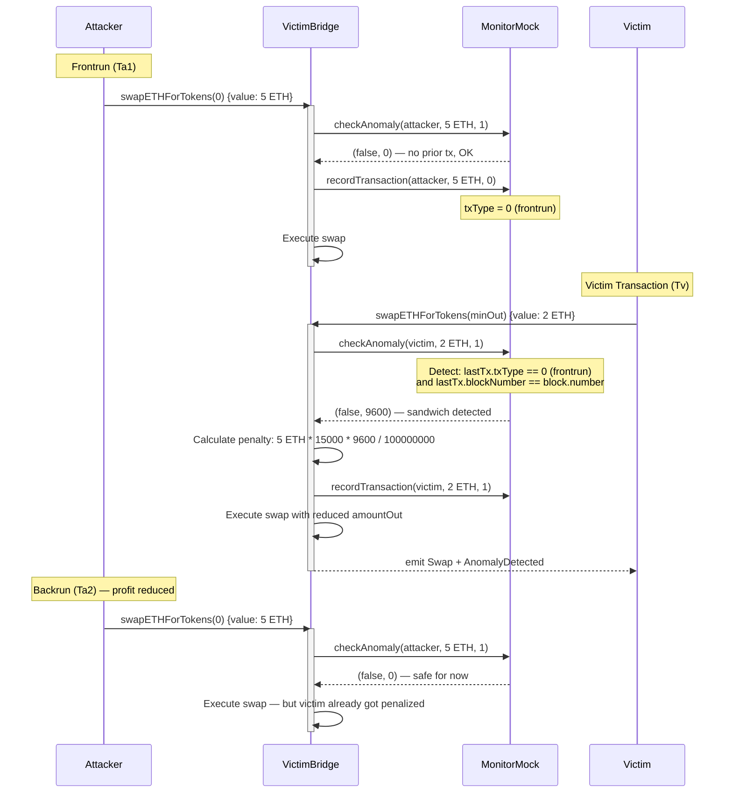
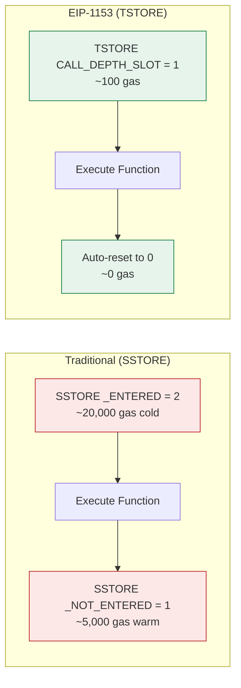

# Arsitektur Sistem

Dokumentasi arsitektur untuk skripsi "Optimalisasi Gas dan Keamanan Smart Contract Bridge Menggunakan EIP-1153 Transient Storage dan Early Warning System".

---

## Class Diagram



---

## Sequence Diagram: Deposit Normal



---

## Sequence Diagram: Reentrancy Attack Blocked



---

## Sequence Diagram: MEV Sandwich Detection



---

## Flowchart: Dynamic Rollup Submission Engine

```mermaid
flowchart TD
    Start[New Block] --> TxGen[Generate Random Transactions]
    TxGen --> Mempool[Add to Mempool]
    Mempool --> CalcEffective[Calculate Effective Size:<br/>effective = txCount * 120 * 0.88]

    CalcEffective --> CheckTarget{effective >= 100KB<br/>OR delay >= 25 blocks?}

    CheckTarget -->|No| Wait[Wait for Next Block]
    Wait --> TxGen

    CheckTarget -->|Yes| CompareCost[Calculate Costs:<br/>Calldata = effective * 16 * L1Fee<br/>Blob = 128KB * BlobFee]

    CompareCost --> Decision{Blob Cost<br/>< Calldata Cost?}

    Decision -->|Yes| UseBlob[Submit via BLOB<br/>(EIP-4844)]
    Decision -->|No| UseCalldata[Submit via CALLDATA<br/>(Fallback)]

    UseBlob --> Record[Record Batch in History]
    UseCalldata --> Record

    Record --> ResetMempool[Reset Mempool Counter]
    ResetMempool --> TxGen

    style UseBlob fill:#e6f4ec,stroke:#0d7a3f
    style UseCalldata fill:#fde8e8,stroke:#b91c1c
    style CheckTarget fill:#e8eefb,stroke:#1a56db
    style Decision fill:#fef3cd,stroke:#b45309
```

---

## Architecture Overview

```
┌─────────────────────────────────────────────────────┐
│                  DYNAMIC ROLLUP ENGINE               │
│  Python: Monte Carlo Simulation (100 runs x 1000 blocks) │
│  Output: 98.21% cost savings (Blob vs Calldata)     │
└─────────────────────┬───────────────────────────────┘
                      │
┌─────────────────────▼───────────────────────────────┐
│              SMART CONTRACT BRIDGE                   │
│                                                      │
│  ┌──────────┐  ┌──────────┐  ┌──────────────────┐  │
│  │ Tier A   │  │ Tier B   │  │ Tier C           │  │
│  │ Baseline │  │ Static   │  │ Dynamic (EIP-1153)│  │
│  │          │  │          │  │ + EWS             │  │
│  │ No guard │  │ CEI      │  │ TSTORE/TLOAD      │  │
│  │ Reentr-  │  │ Packing  │  │ MEV Detection     │  │
│  │ anciable │  │ Safe     │  │ Emergency Pause   │  │
│  └──────────┘  └──────────┘  └──────────────────┘  │
└─────────────────────┬───────────────────────────────┘
                      │
┌─────────────────────▼───────────────────────────────┐
│                    TESTING                           │
│  86 tests: Fuzz, Invariant, Edge Case, Security     │
│  Statistical: t-test, CI 95%, Cohen's d             │
│  Audit: Slither (80 findings, 0 critical)           │
└─────────────────────────────────────────────────────┘
```

---

## EIP-1153 Transient Storage Flow


