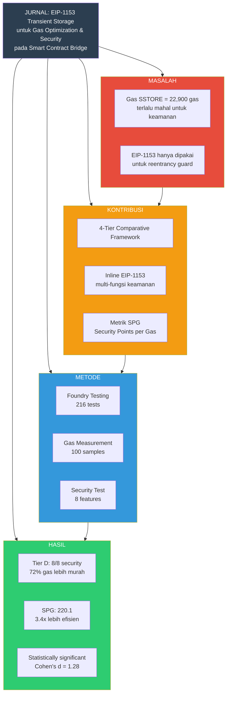

# MIND MAP JURNAL

## Fokus: Kontribusi & Hasil Penelitian



---

## Struktur Paper (IEEE Format)

### 1. INTRODUCTION
```
1.1 Background
    ├── DeFi growth + bridge importance
    ├── Security challenges (reentrancy, MEV)
    └── Gas cost problem

1.2 Problem Statement
    ├── No comparative framework for bridge security
    ├── EIP-1153 underutilized
    └── No cost-effectiveness metric

1.3 Research Objectives
    ├── Compare 4-tier architecture
    ├── Prove Tier D efficiency
    └── Introduce SPG metric
```

### 2. METHODOLOGY
```
2.1 Research Paradigm
    └── Empirical-quantitative

2.2 System Design
    ├── Tier A: Unoptimized
    ├── Tier B: Static optimization
    ├── Tier C: External dynamic
    └── Tier D: Inline EIP-1153

2.3 Testing Framework
    ├── Foundry v1.7.1
    ├── Solidity 0.8.28
    └── 216 test cases

2.4 Measurement
    ├── Gas: 100 samples/operation
    └── Security: 8 features
```

### 3. RESULTS AND DISCUSSION
```
3.1 Gas Comparison
    ├── Table: Gas per tier per function
    └── Figure: Gas reduction chart

3.2 Security Analysis
    ├── Table: Security features per tier
    └── Figure: Security score comparison

3.3 SPG Analysis
    ├── Table: SPG per tier
    └── Figure: SPG ranking

3.4 Statistical Validation
    ├── Welch's t-test results
    └── Cohen's d effect size
```

### 4. CONCLUSION
```
4.1 Key Findings
    ├── Tier D achieves 8/8 security
    ├── 72-88% gas reduction vs Tier C
    └── SPG 220.1 (best cost-effectiveness)

4.2 Contributions
    ├── First comparative framework
    ├── Inline EIP-1153 multi-function
    └── SPG metric introduction
```

---

## Summary Table

| Metric | Tier A | Tier B | Tier C | Tier D | Winner |
|--------|--------|--------|--------|--------|--------|
| Security | 0/8 | 2/8 | 8/8 | 8/8 | C & D |
| Gas Deposit | 58,829 | 56,707 | 173,461 | 103,652 | B |
| SPG | 0 | 63.6 | 65.2 | **220.1** | **D** |
| Ranking | 4 | 3 | 2 | **1** | **D** |
