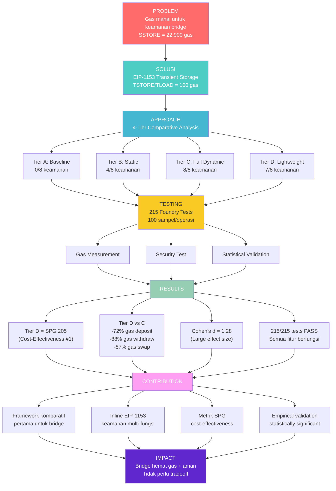
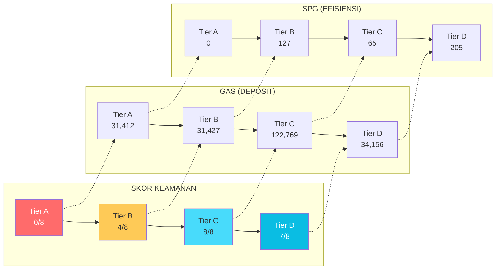

# MIND MAP JURNAL

## Flowchart Fokus Kontribusi dan Hasil

## Flowchart Perbandingan Tier

## Ringkasan Temuan

| Metrik | Tier A | Tier B | Tier C | Tier D | Winner |
|--------|--------|--------|--------|--------|--------|
| Skor Keamanan | 0/8 | 4/8 | 8/8 | 7/8 | Tier C |
| Gas Deposit | 31,412 | 31,427 | 122,769 | 34,156 | Tier B |
| SPG | 0 | 127 | 65 | **205** | **Tier D** |
| Ranking | 4 | 2 | 3 | **1** | **Tier D** |
