# MIND MAP ALUR PENELITIAN

## Alur Penelitian: Dari Masalah Sampai Solusi

```mermaid
graph TD
    START["MEMULAI PENELITIAN"] --> M1

    subgraph M1["LANGKAH 1: IDENTIFIKASI MASALAH"]
        M1A["Bridge blockchain sering diserang<br/>Ronin $620M, Wormhole $320M"]
        M1B["Gas SSTORE mahal<br/>22.900 gas per transaksi"]
        M1C["EIP-1153 belum optimal<br/>50%+ hanya untuk reentrancy guard"]
    end

    M1 --> M2

    subgraph M2["LANGKAH 2: TINJAUAN PUSTAKA"]
        M2A["Kumpulkan 20 paper<br/>gas optimization + security"]
        M2B["Identifikasi gap<br/>belum ada framework komparatif"]
        M2C["Rumusan masalah<br/>3 pertanyaan penelitian"]
    end

    M2 --> M3

    subgraph M3["LANGKAH 3: RANCANG ARSITEKTUR"]
        M3A["Tier A: Unoptimized<br/>baseline tanpa optimasi"]
        M3B["Tier B: Static Only<br/>CEI + variable packing"]
        M3C["Tier C: Full Dynamic<br/>external calls + MonitorMock"]
        M3D["Tier D: Lightweight<br/>inline EIP-1153 (kontribusi)"]
    end

    M3 --> M4

    subgraph M4["LANGKAH 4: IMPLEMENTASI KONTRAK"]
        M4A["Implementasi 4 kontrak<br/>Solidity 0.8.28"]
        M4B["Implementasi keamanan<br/>8 fitur keamanan"]
        M4C["Implementasi EIP-1153<br/>TSTORE/TLOAD inline"]
    end

    M4 --> M5

    subgraph M5["LANGKAH 5: TULIS TEST CASES"]
        M5A["13 file test<br/>216 test cases"]
        M5B["10 metode pengujian<br/>unit, fuzz, invariant, dll"]
        M5C["Attack simulation<br/>reentrancy + MEV"]
    end

    M5 --> M6

    subgraph M6["LANGKAH 6: JALANKAN TESTS"]
        M6A["Foundry test<br/>216 tests PASS"]
        M6B["Gas measurement<br/>100 sampel/operasi"]
        M6C["Security verification<br/>8 fitur per tier"]
    end

    M6 --> M7

    subgraph M7["LANGKAH 7: ANALISIS KEAMANAN"]
        M7A["Slither<br/>45 findings, 0 critical"]
        M7B["Solhint<br/>0 errors, 260 warnings"]
        M7C["forge coverage<br/>88.86% lines"]
    end

    M7 --> M8

    subgraph M8["LANGKAH 8: ANALISIS STATISTIK"]
        M8A["Welch's t-test<br/>p-value < 0.001"]
        M8B["Cohen's d<br/>220.64 (large effect)"]
        M8C["SPG calculation<br/>Tier D: 220.1 (terbaik)"]
    end

    M8 --> M9

    subgraph M9["LANGKAH 9: TULIS HASIL"]
        T1["Gas: Tier D hemat 72-88%"]
        T2["Security: Tier D 8/8 (sempurna)"]
        T3["SPG: Tier D 3.4x lebih efisien"]
        T4["Statistik: signifikan (p < 0.001)"]
    end

    T1 --> T5
    T2 --> T5
    T3 --> T5
    T4 --> T5

    T5["KESIMPULAN:<br/>EIP-1153 inline = solusi optimal"]

    T5 --> OUT1
    T5 --> OUT2

    OUT1["SKRIPSI<br/>BAB 1-5"]
    OUT2["JURNAL<br/>IEEE Format"]

    START --> M1

    style START fill:#2c3e50,color:#fff
    style M1 fill:#e74c3c,color:#fff
    style M2 fill:#e67e22,color:#fff
    style M3 fill:#f1c40f,color:#333
    style M4 fill:#2ecc71,color:#fff
    style M5 fill:#1abc9c,color:#fff
    style M6 fill:#3498db,color:#fff
    style M7 fill:#9b59b6,color:#fff
    style M8 fill:#8e44ad,color:#fff
    style M9 fill:#2c3e50,color:#fff
    style T5 fill:#e74c3c,color:#fff
    style OUT1 fill:#1abc9c,color:#fff
    style OUT2 fill:#1abc9c,color:#fff
```



---

## Penjelasan Setiap Langkah

### LANGKAH 1: IDENTIFIKASI MASALAH
> "Mengapa penelitian ini perlu dilakukan?"
- Bridge sering diserang (miliaran dollar hilang)
- Gas untuk keamanan sangat mahal
- EIP-1153 belum dimanfaatkan optimal

### LANGKAH 2: TINJAUAN PUSTAKA
> "Apa yang sudah dilakukan orang lain?"
- Kumpulkan 20 paper relevan
- Identifikasi gap penelitian
- Rumuskan 3 pertanyaan penelitian

### LANGKAH 3: RANCANG ARSITEKTUR
> "Bagaimana solusinya?"
- Rancang 4 tier bridge (A/B/C/D)
- Tier D = kontribusi utama (inline EIP-1153)

### LANGKAH 4: IMPLEMENTASI KONTRAK
> "Bangun sistemnya"
- Implementasi 4 kontrak Solidity
- Implementasi 8 fitur keamanan
- Implementasi EIP-1153 inline

### LANGKAH 5: TULIS TEST CASES
> "Bagaimana cara membuktikan?"
- Tulis 216 test cases (13 file)
- Gunakan 10 metode pengujian
- Sertakan attack simulation

### LANGKAH 6: JALANKAN TESTS
> "Apakah sistem bekerja?"
- Jalankan semua tests (216 PASS)
- Ukur gas (100 sampel/operasi)
- Verifikasi keamanan (8 fitur)

### LANGKAH 7: ANALISIS KEAMANAN
> "Apakah kode aman?"
- Slither: 0 critical vulnerabilities
- Solhint: 0 errors
- Coverage: 88.86% lines

### LANGKAH 8: ANALISIS STATISTIK
> "Apakah hasil signifikan?"
- Welch's t-test: p < 0.001
- Cohen's d: 220.64 (large effect)
- SPG: Tier D = 220.1 (terbaik)

### LANGKAH 9: TULIS HASIL
> "Apa yang ditemukan?"
- Gas: Tier D hemat 72-88%
- Security: Tier D 8/8 (sempurna)
- SPG: Tier D 3.4x lebih efisien
- Statistik: signifikan

---

## Output Penelitian

| Output | Format | Isi |
|--------|--------|-----|
| **Skripsi** | BAB 1-5 | Pendahuluan, Tinjauan Pustaka, Metodologi, Hasil, Kesimpulan |
| **Jurnal** | IEEE Format | Abstract, Introduction, Methodology, Results, Conclusion |

---

## Ringkasan Alur

```
MASALAH → LITERATUR → RANCANGAN → IMPLEMENTASI → TESTS → ANALISIS → HASIL → KESIMPULAN
   ↓           ↓           ↓            ↓           ↓         ↓         ↓          ↓
Mengapa?    Apa ada?    Bagaimana?    Bangun?      Buktikan?  Validasi?  Temuan?    Artinya?
```
