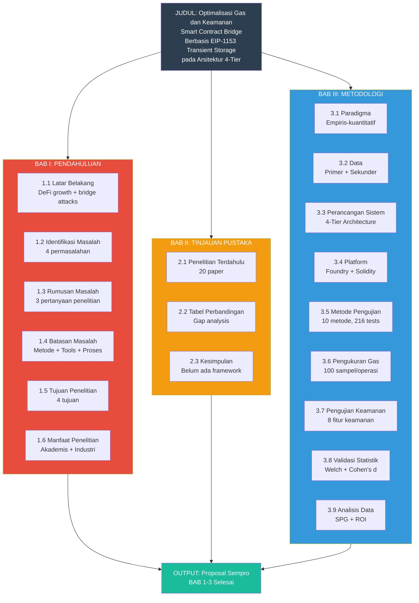

# MIND MAP SEMPRO (BAB 1-3)

## Alur Penelitian: Dari Masalah Sampai Metodologi



---

## Detail Isi Setiap BAB

### BAB I: PENDAHULUAN

| Sub-bab | Isi Utama |
|---------|-----------|
| 1.1 Latar Belakang | DeFi growth, bridge attacks ($1.13B), gas SSTORE 22.900, EIP-1153 solusi |
| 1.2 Identifikasi Masalah | 4 masalah: gas tinggi, external calls, belum ada framework, EIP-1153 belum optimal |
| 1.3 Rumusan Masalah | 3 pertanyaan: optimasi gas, arsitektur 4-tier, penghematan EIP-1153 |
| 1.4 Batasan Masalah | Metode (7 poin), Tools (10 poin), Proses (7 poin) |
| 1.5 Tujuan Penelitian | 4 tujuan: optimasi, rancang, buktikan, ukur SPG |
| 1.6 Manfaat Penelitian | Penulis, Universitas, Pengembang + Peneliti |

### BAB II: TINJAUAN PUSTAKA

| Sub-bab | Isi Utama |
|---------|-----------|
| 2.1 Penelitian Terdahulu | 20 paper: gas optimization, security, EIP-1153, bridge |
| 2.2 Tabel Perbandingan | Gap analysis: belum ada framework komparatif |
| 2.3 Kesimpulan | Belum ada yang menggabungkan optimasi gas + keamanan inline |

### BAB III: METODOLOGI

| Sub-bab | Isi Utama |
|---------|-----------|
| 3.1 Paradigma | Empiris-kuantitatif (ukur fakta) |
| 3.2 Data | Primer (gas + security) + Sekunder (literatur) |
| 3.3 Perancangan | 4-Tier: A (baseline), B (statis), C (dynamic eksternal), D (dynamic inline) |
| 3.4 Platform | Solidity 0.8.28, Foundry v1.7.1, EVM Cancun |
| 3.5 Metode Pengujian | 10 metode: unit, integration, fuzz, invariant, gas benchmark, statistical, attack sim, economic sim, state machine, edge case |
| 3.6 Pengukuran Gas | 100 sampel/operasi, statistik deskriptif, CI 95% |
| 3.7 Pengujian Keamanan | 8 fitur: reentrancy, MEV, penalty, pause, block tracking, cross-function, consecutive, custom errors |
| 3.8 Validasi Statistik | Welch's t-test + Cohen's d effect size |
| 3.9 Analisis Data | SPG (Security Points per Gas) + ROI serangan |

---

## Tools yang Digunakan

| Kategori | Tools | Fungsi |
|----------|-------|--------|
| Development | Solidity 0.8.28 | Bahasa pemrograman |
| Compiler | Foundry v1.7.1 | Kompilasi + testing |
| EVM | Cancun | Mendukung EIP-1153 |
| Static Analysis | Slither v0.11.5 | Deteksi vulnerability |
| Linting | Solhint | Validasi best practices |
| Coverage | forge coverage | Ukur kode teruji (88.86%) |
| Gas Profiling | forge --gas-report | Gas detail per fungsi |

---

## Flow Logika Penulisan

```
BAB I: "Mengapa penelitian ini ada?" (Masalah)
  ↓
BAB II: "Apa yang sudah dilakukan orang lain?" (Literatur)
  ↓
BAB III: "Bagaimana cara membuktikan?" (Metode)
  ↓
OUTPUT: Proposal Sempro (BAB 1-3)
```
