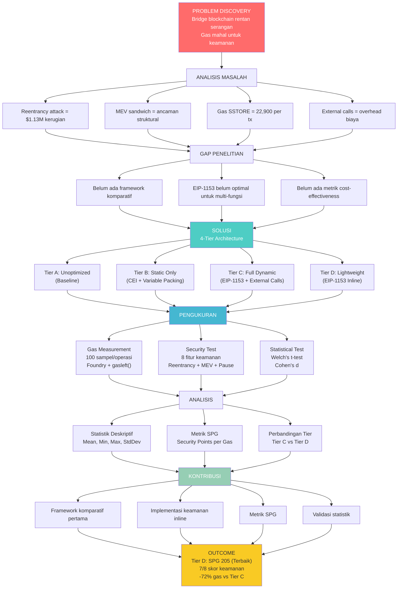

# MIND MAP SEMINAR PROPOSAL

## Flowchart Rencana Penelitian

## Legenda

| Warna | Keterangan |
|-------|------------|
| Merah | Problem Discovery |
| Hijau | Solusi (4-Tier) |
| Biru | Pengukuran |
| Hijau Muda | Kontribusi |
| Kuning | Outcome |
