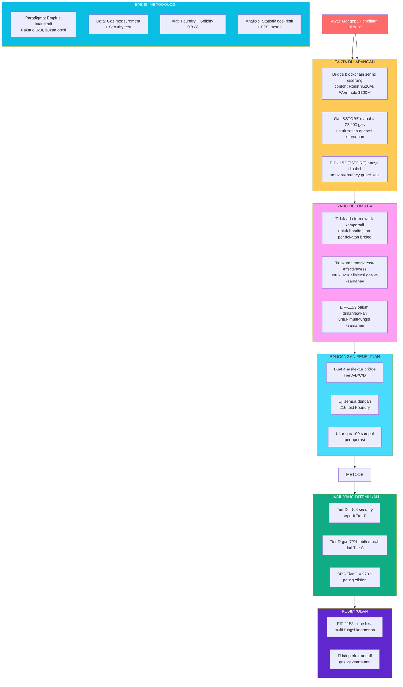

# MIND MAP SEMPRO

## Alur Penelitian: Dari Masalah Sampai Solusi



## Penjelasan Alur

### Step 1: MASALAH (BAB I)
> "Mengapa penelitian ini penting?"
- Bridge sering diserang (miliaran dollar hilang)
- Gas untuk keamanan mahal
- EIP-1153 belum optimal

### Step 2: GAP (BAB I → BAB II)
> "Apa yang belum diteliti orang lain?"
- Tidak ada yang membandingkan 4 arsitektur bridge
- Tidak ada metrik untuk ukur gas vs keamanan
- EIP-1153 hanya dipakai untuk 1 fungsi

### Step 3: SOLUSI (BAB III)
> "Bagaimana cara membuktikan?"
- Rancang 4 tier bridge (A/B/C/D)
- Uji dengan Foundry (216 test)
- Ukur gas (100 sampel)
- Bandingkan hasilnya

### Step 4: HASIL (BAB IV)
> "Apa yang ditemukan?"
- Tier D: keamanan sama (8/8), gas 72% lebih murah
- SPG Tier D paling tinggi (220.1)

### Step 5: KESIMPULAN (BAB V)
> "Apa artinya?"
- EIP-1153 bisa jadi platform keamanan multi-fungsi
- Tidak perlu pilih antara gas murah atau keamanan

---

## Struktur Penulisan

```
BAB I: PENDAHULUAN (1.1 - 1.6)
├── 1.1 Latar Belakang → Fakta masalah
├── 1.2 Identifikasi Masalah → 4 masalah
├── 1.3 Rumusan Masalah → 3 pertanyaan
├── 1.4 Batasan Masalah → Fokus EIP-1153
├── 1.5 Tujuan Penelitian → 3 tujuan
└── 1.6 Manfaat Penelitian → Akademis + Industri

BAB II: TINJAUAN PUSTAKA (2.1 - 2.3)
├── 2.1 Penelitian Terdahulu → 20 paper
├── 2.2 Tabel Perbandingan → Gap analysis
└── 2.3 Kesimpulan Perbandingan → Belum ada framework

BAB III: METODOLOGI (3.1 - 3.5)
├── 3.1 Paradigma → Empiris-kuantitatif
├── 3.2 Data → Gas + Security
├── 3.3 Alat → Foundry
├── 3.4 Rancangan → 4-Tier
└── 3.5 Analisis → Statistik + SPG
```
