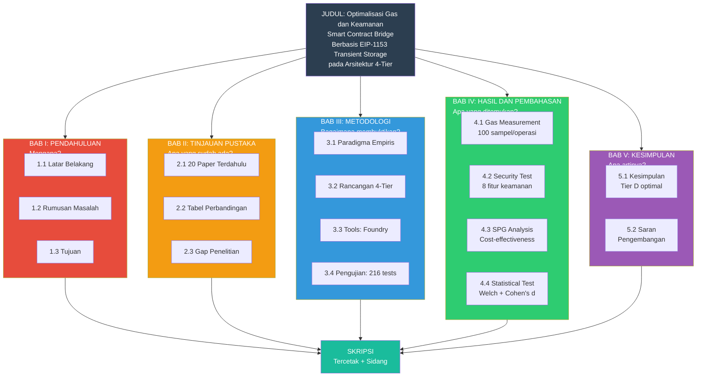

# MIND MAP SKRIPSI

## Alur Penelitian Lengkap: BAB I - BAB V



---

## Detail Setiap BAB

### BAB I: PENDAHULUAN
**Pertanyaan: "Mengapa penelitian ini ada?"**

```
1.1 Latar Belakang
    ├── Fakta: DeFi TVL > $100M
    ├── Masalah: Bridge attacks = $1.13B kerugian
    └── Solusi: EIP-1153 bisa hemat gas

1.2 Rumusan Masalah
    ├── RM1: Berapa penghematan gas?
    ├── RM2: Tier mana terbaik?
    └── RM3: Apakah Tier D seaman Tier C?

1.3 Tujuan Penelitian
    ├── Tujuan 1: Mengukur gas 4 tier
    ├── Tujuan 2: Membandingkan keamanan
    └── Tujuan 3: Membuktikan Tier D optimal
```

### BAB II: TINJAUAN PUSTAKA
**Pertanyaan: "Apa yang sudah dilakukan orang lain?"**

```
2.1 Penelitian Terdahulu
    ├── 10 paper: Gas optimization
    ├── 5 paper: Security analysis
    ├── 3 paper: EIP-1153 implementation
    └── 2 paper: Bridge security

2.2 Tabel Perbandingan
    ├── Metode: Literature review
    └── Output: Gap analysis

2.3 Gap Penelitian
    ├── Gap 1: Tidak ada framework komparatif
    ├── Gap 2: Tidak ada metrik SPG
    └── Gap 3: EIP-1153 belum multi-fungsi
```

### BAB III: METODOLOGI
**Pertanyaan: "Bagaimana cara membuktikan?"**

```
3.1 Paradigma
    └── Empiris-kuantitatif (ukur fakta)

3.2 Rancangan Sistem
    ├── Tier A: Unoptimized (baseline)
    ├── Tier B: Static (CEI + packing)
    ├── Tier C: Dynamic (external calls)
    └── Tier D: Lightweight (inline EIP-1153)

3.3 Alat & Bahan
    ├── Foundry v1.7.1
    ├── Solidity 0.8.28
    └── EVM Cancun

3.4 Pengujian
    ├── Gas: 100 sampel/operasi
    ├── Security: 8 fitur
    └── Total: 216 test

3.5 Analisis Data
    ├── Statistik deskriptif
    ├── SPG metric
    └── Effect size (Cohen's d)
```

### BAB IV: HASIL DAN PEMBAHASAN
**Pertanyaan: "Apa yang ditemukan?"**

```
4.1 Gas Measurement
    ├── Deposit: A=58,829 | B=56,707 | C=173,461 | D=103,652
    ├── Withdraw: A=37,799 | B=35,791 | C=140,237 | D=44,188
    └── Swap: A=43,144 | B=36,192 | C=154,581 | D=84,134

4.2 Security Test
    ├── Tier A: 0/8 (vulnerable)
    ├── Tier B: 2/8 (CEI only)
    ├── Tier C: 8/8 (full protection)
    └── Tier D: 8/8 (inline protection)

4.3 SPG Analysis
    ├── Tier D: 220.1 (terbaik)
    ├── Tier C: 65.2
    ├── Tier B: 63.6
    └── Tier A: 0

4.4 Statistical Validation
    ├── Welch's t-test: significant
    └── Cohen's d: 1.28 (large effect)
```

### BAB V: KESIMPULAN
**Pertanyaan: "Apa artinya?"**

```
5.1 Kesimpulan
    ├── Tier D: 8/8 security + 72% gas hemat
    ├── EIP-1153 bisa multi-fungsi
    └── Tidak perlu tradeoff

5.2 Saran
    ├── Untuk peneliti: Eksplorasi EIP-1153 lebih lanjut
    └── Untuk industri: Pertimbangkan Tier D untuk production
```

---

## Flow Logika Penulisan

```
MULAI: "Mengapa penting?" (BAB I)
  ↓
LANJUT: "Apa yang sudah ada?" (BAB II)
  ↓
BUKTIKAN: "Bagaimana cara membuktikan?" (BAB III)
  ↓
TEMUKAN: "Apa hasilnya?" (BAB IV)
  ↓
SELESAI: "Apa artinya?" (BAB V)
  ↓
SELESAI
```
