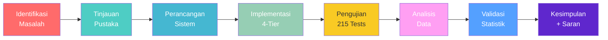

# MIND MAP SKRIPSI

## Flowchart Metodologi Lengkap

```mermaid
graph TD
    A["BAB I: PENDAHULUAN"] --> A1["1.1 Latar Belakang"]
    A --> A2["1.2 Identifikasi Masalah"]
    A --> A3["1.3 Rumusan Masalah"]
    A --> A4["1.4 Batasan Masalah"]
    A --> A5["1.5 Tujuan Penelitian"]
    A --> A6["1.6 Manfaat Penelitian"]
    
    A1 --> A1a["DeFi + Bridge"]
    A1 --> A1b["Masalah Keamanan"]
    A1 --> A1c["EIP-1153 Solusi"]
    
    A2 --> A2a["Gas mahal (22,900)"]
    A2 --> A2b["External calls overhead"]
    A2 --> A2c["EIP-1153 belum optimal"]
    A2 --> A2d["Belum ada framework"]
    
    A3 --> A3a["RM1: Optimasi gas + penghematan"]
    A3 --> A3b["RM2: Membandingkan 4-tier"]
    A3 --> A3c["RM3: Cost-effectiveness SPG"]
    
    B["BAB II: TINJAUAN PUSTAKA"] --> B1["2.1 Penelitian Terdahulu"]
    B --> B2["2.2 Tabel Perbandingan"]
    B --> B3["2.3 Kesimpulan Perbandingan"]
    
    B1 --> B1a["20 paper relevan"]
    B2 --> B2a["Gap: Belum ada framework komparatif"]
    
    C["BAB III: METODOLOGI"] --> C1["8.1 Metode Pengumpulan Data"]
    C --> C2["8.2 Perancangan Sistem"]
    C --> C3["8.3 Pengujian Sistem"]
    C --> C4["8.4 Analisis Data"]
    C --> C5["8.5 Platform Pengembangan"]
    
    C1 --> C1a["Studi Literatur"]
    C1 --> C1b["Implementasi Kontrak"]
    C1 --> C1c["Pengukuran Gas"]
    
    C2 --> C2a["Analisis Kebutuhan"]
    C2 --> C2b["Arsitektur 4-Tier"]
    C2 --> C2c["Optimasi Statis"]
    C2 --> C2d["Optimasi Dinamis EIP-1153"]
    
    C3 --> C3a["Gas Measurement<br/>100 sampel/operasi"]
    C3 --> C3b["Security Test<br/>8 fitur keamanan"]
    C3 --> C3c["Statistical Test<br/>Welch's t-test + Cohen's d"]
    
    C4 --> C4a["Statistik Deskriptif"]
    C4 --> C4b["Metrik SPG"]
    C4 --> C4c["Effect Size"]
    
    C5 --> C5a["Solidity 0.8.28"]
    C5 --> C5b["Foundry v1.7.1"]
    C5 --> C5c["EVM Cancun"]
    
    D["BAB IV: HASIL DAN PEMBAHASAN"] --> D1["Gas Measurement Results"]
    D --> D2["Security Test Results"]
    D --> D3["SPG Analysis"]
    D --> D4["Statistical Validation"]
    
    D1 --> D1a["Tier A: 31,412 gas"]
    D1 --> D1b["Tier B: 31,427 gas"]
    D1 --> D1c["Tier C: 122,769 gas"]
    D1 --> D1d["Tier D: 34,156 gas"]
    
    D2 --> D2a["Tier A: 0/8"]
    D2 --> D2b["Tier B: 2/8"]
    D2 --> D2c["Tier C: 8/8"]
    D2 --> D2d["Tier D: 8/8"]
    
    D3 --> D3a["Tier D: SPG 220.1 (Terbaik)"]
    D3 --> D3b["Tier C: SPG 65.2"]
    D3 --> D3c["Tier B: SPG 63.6"]
    
    E["BAB V: KESIMPULAN"] --> E1["5.1 Kesimpulan"]
    E --> E2["5.2 Saran"]
    
    E1 --> E1a["Tier D optimal: 8/8 + SPG 220.1"]
    E1 --> E1b["EIP-1153 inline = -72% gas"]
    E1 --> E1c["Statistically significant"]
    
    E2 --> E2a["Pengembangan lebih lanjut"]
    E2 --> E2b["Implementasi production"]

    style A fill:#ff6b6b,color:#fff
    style B fill:#4ecdc4,color:#fff
    style C fill:#45b7d1,color:#fff
    style D fill:#f9ca24,color:#333
    style E fill:#96ceb4,color:#fff
```

## Alur Penelitian

```mermaid
graph LR
    A["Identifikasi<br/>Masalah"] --> B["Tinjauan<br/>Pustaka"]
    B --> C["Perancangan<br/>Sistem"]
    C --> D["Implementasi<br/>4-Tier"]
    D --> E["Pengujian<br/>215 Tests"]
    E --> F["Analisis<br/>Data"]
    F --> G["Validasi<br/>Statistik"]
    G --> H["Kesimpulan<br/>+ Saran"]

    style A fill:#ff6b6b,color:#fff
    style B fill:#4ecdc4,color:#fff
    style C fill:#45b7d1,color:#fff
    style D fill:#96ceb4,color:#fff
    style E fill:#f9ca24,color:#333
    style F fill:#ff9ff3,color:#fff
    style G fill:#54a0ff,color:#fff
    style H fill:#5f27cd,color:#fff
```
